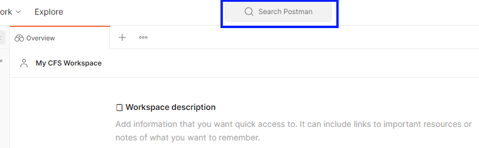
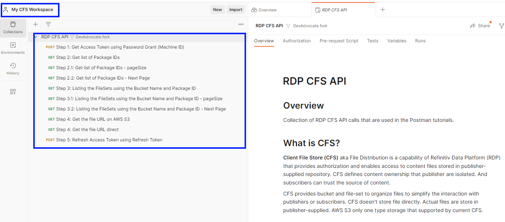
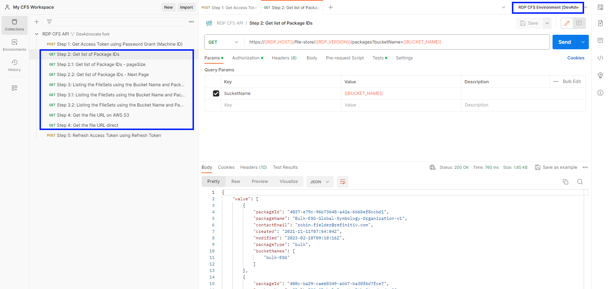
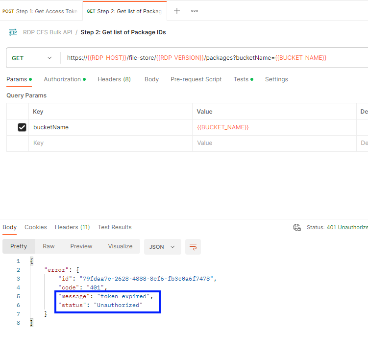
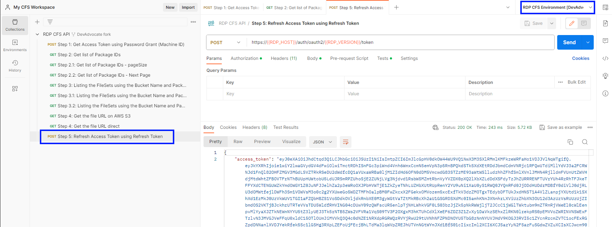

# A Generic and Step By Step Workflow for RDP Client File Store (CFS) File API
- version: 1.0.0
- Last update: Dec 2023
- Environment: Jupyter Notebook
- Prerequisite: [Access to RDP credentials](#prerequisite)

Example Code Disclaimer:
ALL EXAMPLE CODE IS PROVIDED ON AN “AS IS” AND “AS AVAILABLE” BASIS FOR ILLUSTRATIVE PURPOSES ONLY. LSEG MAKES NO REPRESENTATIONS OR WARRANTIES OF ANY KIND, EXPRESS OR IMPLIED, AS TO THE OPERATION OF THE EXAMPLE CODE, OR THE INFORMATION, CONTENT, OR MATERIALS USED IN CONNECTION WITH THE EXAMPLE CODE. YOU EXPRESSLY AGREE THAT YOUR USE OF THE EXAMPLE CODE IS AT YOUR SOLE RISK.

## <a id="intro"></a>Introduction

This demo application shows the generic workflow of Our Delivery Platform (previously known as Refinitiv Data Platform - RDP) CFS API. The workflow can be applied to any Bucket (ESG, Symbology, Green Revenue, etc). I am demonstrating the workflow in [Python](https://www.python.org/) and [Jupyter](https://jupyter.org/) environment. However, the RDP APIs are the web-based API that any programming langues can connect and consume data from via the HTTP RESTful API. 

## <a id="prerequisite"></a>Prerequisite

Before I am going further, there is some prerequisite, dependencies, and libraries that the project is needed.

### Access to the RDP with the your desire CFS file permission

This project uses RDP access credentials with the CFS file permission.

Please contact your LSEG representative to help you with the RDP account and services.

### Internet Access

This demonstration connects to RDP on AWS via a public internet.

### Python and Jupyter Notebook.

This project uses [Python](https://www.python.org/) and [Jupyter](https://jupyter.org/) environment.

The Python [Anaconda](https://www.anaconda.com/distribution/) or [MiniConda](https://docs.conda.io/en/latest/miniconda.html) distribution/package manager is recommended.

## <a id="whatis_rdp"></a>What is Refinitiv Data Platform (RDP) APIs?

The [Refinitiv Data Platform (RDP) APIs](https://developers.lseg.com/en/api-catalog/refinitiv-data-platform/refinitiv-data-platform-apis) provide various Refinitiv data and content for developers via easy-to-use Web-based API.

RDP APIs give developers seamless and holistic access to all of the Refinitiv content such as Environmental Social and Governance (ESG), News, Research, etc, and commingled with their content, enriching, integrating, and distributing the data through a single interface, delivered wherever they need it.  The RDP APIs delivery mechanisms are the following:
* Request - Response: RESTful web service (HTTP GET, POST, PUT or DELETE) 
* Alert: delivery is a mechanism to receive asynchronous updates (alerts) to a subscription. 
* Bulks:  deliver substantial payloads, like the end-of-day pricing data for the whole venue. 
* Streaming: deliver real-time delivery of messages.

This example project is focusing on the Request-Response: RESTful web service delivery method only.  


For more detail regarding the Refinitiv Data Platform, please see the following APIs resources: 
- [Quick Start](https://developers.lseg.com/en/api-catalog/refinitiv-data-platform/refinitiv-data-platform-apis/quick-start) page.
- [Tutorials](https://developers.lseg.com/en/api-catalog/refinitiv-data-platform/refinitiv-data-platform-apis/tutorials) page.

## <a id="what_is_cfs"></a>What is CFS?

**Client File Store (CFS)** aka File Distribution is a capability of Refinitiv Data Platform (RDP) that provides authorization and enables access to content files stored in publisher-supplied repository. CFS defines content ownership that publisher are isolated. And subscribers can trust the source of content.

CFS is engineered as a self-service metadata tool intend for publishers and subscribers. CFS provides bucket and file-set to organize files to simplify the interaction with publishers or subscribers CFS doesn't store file directly. Actual files are store in publisher-supplied. AWS S3 only one type storage that supported by current CFS.

### Bucket

CFS facilitates buckets for use by Publishers to organize file-sets and files. Buckets store metadata about the files stored in publisher-supplied repositories. Buckets align with subscriptions and can contain multiple file-sets and files.

Publishers are responsible for creating buckets with the CFS API. This is a one-time process. The resulting bucket is owned one or more Publishers and is assigned a unique name that cannot be assigned to another bucket. A Publisher can have multiple buckets if they provide more than one dataset.

Claims are used to control access to buckets, file-sets and files. CFS does not manage or create claims, CFS only enforces them. Claims must be created in AAA. Subscribers must have at least one of the claims on the bucket in order to access the bucket.

Attributes are used to allow Subscribers to filter and search for content. Attributes are one method that a Subscriber can use to find files and/or file-sets.

### Packages

A package is an indivisible set of file-sets that are all delivered together. Packages can consist of multiple file-sets that a grouping of file-sets.

The publisher will define the metadata for each package of content available to subscribers in CFS.  Publishers are responsible for creating Packages and assigning claims to them.

Publisher need to create package first and then publisher able to create file-sets into Packages.

### Fileset

A file-set is an indivisible set of files that are all delivered together. They can consist of multiple files that make up one large file or a grouping of files that represent related content. A file-set can also contain a single file. The Publisher decides the appropriate organization of their file-sets.

Publishers are responsible for creating file-sets into Packages. A Publisher can have multiple file-sets in a bucket.

Once all files have been added to the file-set and are ready for download, the Publisher updates the file-set status to READY. This enables the Publisher to control the release of their files and sets expectations for when the files will be available to subscribers. File-sets with a status of READY cannot be updated or modified. Updates must be published as a new file-set.

To access a file-set, Subscribers must have access to the bucket in which the file-set resides and have all of the claims associate with the file-set.

### Files

Subscribers can only access the files to which they are entitled. On AWS S3, Subscribers can access files using a signed URI that redirects to the file on AWS S3 for downloading.

Files are available for a defined period of time that is determined by the Publisher.

## <a id="how_to_run"></a>How to run the demo application

The first step is to unzip or download the example project folder into a directory of your choice, then set up Python or Postman environments based on your preference.

### <a id="python_example_run"></a>Run the demo Notebook application

1. Open Anaconda Prompt and go to the project's folder.
2. Run the following command in the Anaconda Prompt application to create a Conda environment named *CFS* for the project.
    ``` bash
    (base) $>conda create --name CFS python=3.10
    ```
3. Once the environment is created, activate a Conda *CFS* environment with this command in Anaconda Prompt.
    ``` bash
    (base) $>conda activate CFS
    ```
4. Run the following command to the dependencies in the *CFS* environment 
    ``` bash
    (CFS) $>pip install -r requirements.txt
    ```
5. Once the dependencies installation process is success, run the following command to start the Jupyter Lab application.
    ``` bash
    (CFS) $>jupyter lab
    ```
6. Open a **RDP-Generic-CFS.ipynb**  file and run each cell to learn the RDP CFS File workflow step by step.

    

### <a id="how_to_run_postman"></a>Run the Postman LSEG CFS API Workspace

The [RDP CFS API Postman Workspace](https://www.postman.com/winter-water-515088/workspace/lseg-cfs-api-workspace) is a public workspace in Postman that demonstrates how to use CFS API. It contains the following collection and environment:
- **RDP CFS API Collection**: This collection contain all HTTP requests with the RDP CFS file API. The requests are in ordered from Step 1 to Step 5.
- **RDP CFS API Environment**: This environment contains all parameters consumers need for requesting data with the requests in RDP CFS API Collection (including the credential).

Users can fork these Postman items to their own workspaces. Please follow these five steps to fork the RDP CFS Postman Workspace to a Postman workspace. 

#### 1. Create a new Postman workspace

Open the Postman application, then sign in to the Postman and create a new workspace.


Choose a Blank workspace, and click the Next button.


Set a workspace name, such as “My CFS Workspace”, set the Visibility to Personal, and then click the Create button. 


The new workspace will appear on the list. 


#### 2. Open the LSEG CFS API Workspace

The [LSEG CFS API Workspace](https://www.postman.com/winter-water-515088/workspace/lseg-cfs-api-workspace) is in the public workspace so you can search it in Postman by clicking on “Search Postman”. 



And then, enter “LSEG CFS API”. 


Click on the LSEG CFS API to open the workspace.


This LSEG CFS API workspace will be added to the workspace list.


#### 3. Fork the RDP CFS API Collection

Select the LSEG CFS API workspace from the workspace list, and then select “...” menu of the RDP CFS API collection and choose the "Create a fork" command to fork this collection.


Then, enter the fork label, select the workspace (My CFS Workspace) created in the first step, uncheck “Watch original collection”, and then click on the Fork Collection button. 


The forked collection will be created in the selected workspace. 



#### 4. Fork the Environment

Select the LSEG CFS API workspace from the workspace list, and then select “...” menu of the RDP CFS Environment and choose the "Create a fork" command to fork this environment.


Then, enter the fork label, select the workspace (My CFS Workspace) created in the first step, and then click on the Fork Environment button. 


The forked environment will be created in the selected workspace. Input the ```USERNAME```, ```PASSWORD```, ```APP_KEY```, and ```BUCKET_NAME``` variables with your RDP credential detail.


#### 5. Running Postman Collection

The first step is run the "Step 1" Get Access Token using Password Grant (Machine ID)" request, please make sure that the environment on the top right corner is pointed to the RDP CFS Environment.


You can generate the source code from this Postman request by clicking the ```</>``` button and choose prefer language.


Once the Once authentication is successful, run the requests from step 2 to step 4



You can generate the source code from these Postman requests by clicking the ```</>``` button and choose prefer language on each request too.


If the Access Token is expired, the RDP CFS API requests return "token expired" error message as follows:



You need to refresh the Access Token by requesting "Step 5: Refresh Access Token using Refresh Token", then you can re-run the requests in step 2-4 again.



## Next Steps

You may interested in the following resources for more detail about the CFS data usage:
- [Find environmental footprint of your bond portfolio](https://developers.lseg.com/en/article-catalog/article/Environmental_footprint_of_bond_portfolio) article
- [RDP APIs Green Revenues CFS file Workflow](https://github.com/LSEG-API-Samples/Example.RDP.Python.GreenRevenuesBulk) - a dedicate Green Revenue CFS workflow
- [RDP APIs ESG CFS file Workflow](https://github.com/LSEG-API-Samples/Example.RDP.Python.ESG.PointinTimeBulk) - a dedicate ESG CFS workflow

And much more on the [Developer Portal](https://developers.lseg.com/en) website.

## <a id="references"></a>References

That brings me to the end of my generic CFS file workflow project. For further details, please check out the following resources:

* [Refinitiv Data Platform APIs page](https://developers.lseg.com/en/api-catalog/refinitiv-data-platform/refinitiv-data-platform-apis) on the [Refinitiv Developer Community](https://developers.lseg.com/) website.
* [Refinitiv Data Platform APIs Playground page](https://apidocs.refinitiv.com/Apps/ApiDocs).
* [Refinitiv Data Platform APIs: Introduction to the Request-Response API](https://developers.lseg.com/en/api-catalog/refinitiv-data-platform/refinitiv-data-platform-apis/tutorials#introduction-to-the-request-response-api).
* [Refinitiv Data Platform APIs: Authorization - All about tokens](https://developers.lseg.com/en/api-catalog/refinitiv-data-platform/refinitiv-data-platform-apis/tutorials#authorization-all-about-tokens).
* [Limitations and Guidelines for the RDP Authentication Service](https://developers.lseg.com/en/article-catalog/article/limitations-and-guidelines-for-the-rdp-authentication-service) article.
* [Getting Started with Refinitiv Data Platform](https://developers.lseg.com/en/article-catalog/article/getting-start-with-refinitiv-data-platform) article.
* [CFS API User Guide](https://developers.lseg.com/en/api-catalog/refinitiv-data-platform/refinitiv-data-platform-apis/documentation#cfs-api-user-guide).


For any questions related to Refinitiv Data Platform APIs, please use the [RDP APIs Forum](https://community.developers.refinitiv.com/spaces/231/index.html) on the [Developers Community Q&A page](https://community.developers.refinitiv.com/).